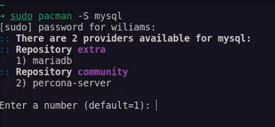

# How to install MariaDB

Arch Linux favors MariaDB, a community-developed fork of MySQL, aiming for drop-in compatibility. In this documentation, we are going to teach how to install **MariaDB**, and we are going to show how to solve some "problems" of security that stop us to work comfortably with a frontend client.

## Installation

For install MariaDB, we need to run this command:

> sudo pacman -S mysql

Once we've done it, we'll have an output like this.

We'll select the option 1

Now we need to create the database dir. Run this:

> sudo mariadb-install-db --user=mysql --basedir=/usr --datadir=/var/lib/mysql

> Tip: If you use something different from /var/lib/mysql for your data dir, you need to set datadir=YOUR_DATADIR under section [mysqld] of your /etc/my.cnf.d/server.cnf.

With this, MariaDB will have installed. Check, start and stop the server with these commands respectively:

> sudo systemctl status mariadb.service
>
> sudo systemctl start mariadb.service
>
> sudo systemctl stop mariadb.service

## Improving The Initial Security

The mysql_secure_installation command will interactively guide you through a number of recommended security measures, such as removing anonymous accounts and removing the test database:

> sudo mysql_secure_installation

We'll mark "yes" in all options and we'll change the password.

> Note: MariadDB doesn't bring by default a password. Just press ENTER when it ask.

## Installing a Frontend Client

To make the development experience more enjoyable, install a frontend client. In this case, we'll install MySQL Workbench.

> sudo pacman -S mysql-workbench

Check if you can connect to the server from MySQL Workbench. If not the case, this could be due to several things.

First, it happened to me that Archcraft doesn't bring a package called "libsecret", then I can't save my password in my client. To solve this, run:

> sudo pacman -S gnome-keyring && sudo pacman -S libsecret

Second, another inconvenience that happened to me was "Access denied for user 'root'@'localhost'". It's because MySql 5.7 by default allows connecting with socket. To allow connection with root and password, then update the values in the table with the next commands:

1) Enter to the server

> sudo mysql -u root -p

2) Show the user authentication tables

> SELECT user,authentication_string,plugin,host FROM mysql.user;

3) Update the values in the table with command these commands:

> SET PASSWORD FOR 'root'@'localhost' = PASSWORD('manager');
>
> FLUSH PRIVILEGES;

Check if you can connect MySQL Workbench with the server. If the problem persist run: 

> ALTER USER 'root'@'localhost' IDENTIFIED VIA mysql_native_password USING PASSWORD('root');
>
> FLUSH PRIVILEGES;

That is all. Check on MySQL Workbench the connection.

